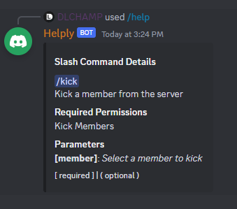

# Helply


A user-friendly Python library designed to streamline the creation of "help" commands for
Discord bots using application commands within the disnake library. This library will automatically parse your commands
and provide details for each command, such as name, description, role and permission checks, etc.

>**Disclaimer**  
Please note that this library is not officially associated with the [disnake](https://github.com/DisnakeDev/disnake) project or any of its maintainers. It is an independent creation by a user of the Disnake library who wanted to streamline the process of creating `/help` commands without needing to
rewrite the implementation each time.


## Key Features
- Consolidating various attributes from `InvokableApplicationCommand` and `APIApplicationCommand` into a single cached object.
- Parsing role and permission checks.
- Ready-to-use methods for populating autocomplete outputs.
- Utility functions that provide ready-to-go embeds and pagination.


## Installation

To install the `helply` package, you will need git. If you don't have git installed on your system, you can download it from [here](https://git-scm.com/downloads).

Once you have git installed, run the following command inside your Python environment to install the package:

```
pip install git+https://github.com/dlchamp/Helply
```

## Usage

After installing the package, you can use it in your project by importing it as follows:

```python
from helply import Helply
```

AppCommands will be created and cached upon first use of `helply` to retrieve commands.
This allows all commands to become registered with Discord before `helply` steps in to create it's own objects with the consolidated attributes provided by `InvokableApplicationCommand` and `APIApplicationCommand`

## Description parsing
Disnake will automatically parse your command descriptions from the docstring in your callback function, or by populating the `description` keyword argument. `Helply` uses that description, however, it also parses descriptions found in the `extras` key-word argument when it finds the "help" key.  This proves exceptionally useful for menu commands that do not normally have a description that is displayed by the user's client.

**Example - User Command**:
```python
# Since this is a user command that does not inherently have a description. We are using
# extras to set the description for the help command.
@bot.user_command(name="View Avatar", extras={"help": "Display the target user's avatar"})
async def view_avatar(...):
    ...
```

While designed to allow command descriptions for your menu commands, you may also use this feature
to create longer descriptions for your slash commands as it would appear in your help response.
For slash commands, this is really only useful if you wish to provide more information that would normally exceed the 100 character limit set by Discord.

> Important
Setting `extras` will override your command.description when displayed in the help response.

In this example, the user will see *"Kick a member from the server"* when attempting to use the command
while *"Removes the target member from the guild"* will appear as the command description in the help response.

```python
@bot.slash_command(
    name="kick",
    description="Kick the target member",
    extras={"help": "Removes the target member from the guild"}
)
async def kick_member(...):
    """Kick a member from the server"""
```


### Support for `@commands` Checks

The `helply` library also supports parsing of `@commands` style checks. For instance, if you are using `@commands.has_permissions()` to restrict command usage, the extension will recognize and display these permission requirements in the help response.

**Example:**
```python
@bot.slash_command(name="kick")
@commands.has_permissions(kick_members=True)
async def kick_member(inter: disnake.GuildCommandInteraction, member: disnake.Member):
    """Kick a member from the server

    Parameters
    ----------
    member: Select a member to kick
    """
```



### Cogs, Categories, and disnake-ext-plugin support
`Helply` is able to parse the cog or category a command belongs to.  This is useful if you wish to display an overview of commands available within a category.  If you are using cogs, you do not have to do anything extra.  The cog associated with a command will be parsed automatically. However, if you're using [disnake-ext-plugins](https://github.com/DisnakeCommunity/disnake-ext-plugins), a command's cog will always be None.  So, to set a commands category, we go back to the `extras` keyword to set the command's category:

```py
@some_plugin.slash_command(name='command', extras={"category": "General"})
async def some_command(inter: disnake.ApplicationCommandInteractions):
    ...

```

### Filtering Commands
When retrieving commands from `Helply`, you may choose to pass in a member's `guild_permissions`.
This will ensure that only commands the user has permissions to use will be retrieved.

Here, if the command is used within a guild, we want to show all commands available within the guild,
including global commands, and only commands that the inter.author is able to use.

> Important
    Permissions are compared against `default_member_permissions`.  Setting this by default
    hides commands from members unable to use them, Passing permissions also allows `helply` to ensure
    these commands stay hidden, even in help responses.
```py
# construct Helply with the provided bot and a sequence of commands to ignore
# ignore commands will not appear in any help responses.
helply = Helply(bot, commands_to_ignore=('help',))

@bot.slash_command(name='help')
async def help_command(inter: disnake.ApplicationCommandInteraction):

    if inter.guild:
        guild_id = inter.guild_id
        permissions = inter.author.guild_permissions
        dm_only = False
    else:
        # command likely used in direct message
        guild_id = None
        permissions = None
        dm_only = True

    commands = helply.get_all_commands(guild_id, permissions=permissions, dm_only=dm_only)
```

## Examples and Documentation

For more examples and documentation, please visit the following links:

- [Example](https://dlchamp.github.io/Helply/examples/basic/)
- [Docs](https://dlchamp.github.io/Helply/)
- You may also join the [discord](https://discord.gg/nmwaDS35sC) to get support or just chat.


## To-Do

- add support for nextcord and py-cord
- contribution guidelines


## Contributing
All contributions are welcome.  Feel free to open an issue or submit a pull request if you'd like to see something added.
Contribution guidelines coming soon™
